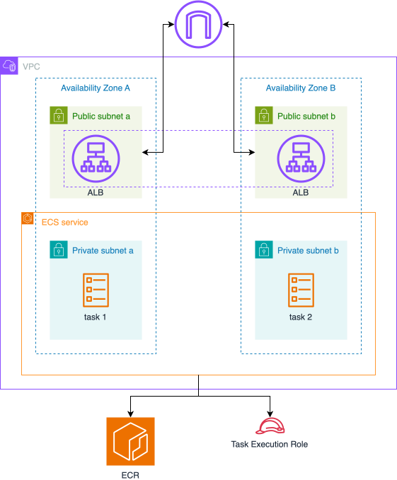

# AWS Advanced Workshop: Container Orchestration and Delivery

## Introduction

Welcome to the AWS Advanced Workshop! This workshop is designed for developers who want to learn about container orchestration, load balancing, and content delivery on AWS. Through hands-on labs, you'll build a production-ready containerized application infrastructure using Pulumi.

## Workshop Architecture Evolution

Throughout this workshop, we'll build our architecture in stages:

1. **ECS Fargate Setup**: Basic ECS cluster with Fargate launch type
   

2. **Load Balancer Integration**: Adding ALB and target groups
   

3. **Container Registry**: Building and pushing custom images to ECR
   

4. **Content Delivery**: Adding CloudFront distribution
   

## Prerequisites

- Basic understanding of AWS and containerization concepts
- Familiarity with Docker
- AWS account with appropriate permissions
- Node.js (version 14 or later)
- Docker installed locally
- AWS CLI version 2 installed and configured
- Previous experience with Pulumi (completion of AWS Fundamentals Workshop recommended)

## Workshop Duration

Total estimated time: 4-6 hours

- Lab 1: 45-60 minutes
- Lab 2: 45-60 minutes
- Lab 3: 60-90 minutes
- Lab 4: 30-45 minutes

## Labs Overview

### Lab 1: ECS Fargate Cluster
- Setting up VPC and networking
- Creating ECS cluster
- Defining task definitions and services

### Lab 2: Application Load Balancer
- Creating ALB
- Configuring listeners and target groups
- Integrating with ECS services

### Lab 3: Container Registry and Docker
- Creating ECR repository
- Building custom Docker image
- Pushing to ECR
- Updating ECS service

### Lab 4: CloudFront Distribution
- Creating CloudFront distribution
- Configuring origin and behaviors
- SSL/TLS setup
- Cache policy configuration

Let's begin your journey into advanced AWS services!