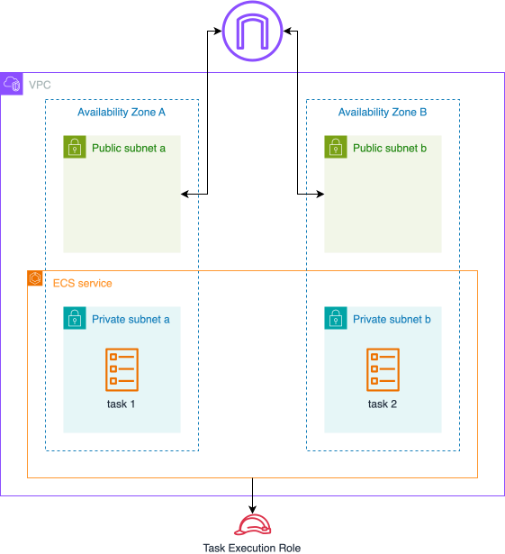

# Lab 1: Building with ECS Fargate

## Overview

In this lab, you'll learn how to deploy containerized applications using Amazon ECS (Elastic Container Service) with AWS Fargate. We'll start with a basic nginx container and set up the foundational infrastructure needed for container orchestration.

## Key Concepts: Containerization and AWS Container Services

### Understanding Containers

Containers represent a fundamental shift in how we package and deploy applications. Unlike traditional deployment methods where applications run directly on servers, containers package the application code together with all its dependencies, ensuring consistent behavior across different environments. This approach solves the age-old problem of "it works on my machine" by creating a standardized unit that runs identically everywhere.

### Container Orchestration with Amazon ECS

Amazon Elastic Container Service (ECS) is AWS's fully managed container orchestration service. It handles the complex tasks of placing containers across a cluster of virtual machines, monitoring their health, and maintaining the desired number of containers to support your application's demands. Think of ECS as a conductor coordinating an orchestra – ensuring each container (musician) plays its part at the right time and in harmony with others.

### Launch Types: Fargate vs EC2

AWS offers two primary ways to run your containers: Fargate and EC2. Fargate represents a serverless approach where you don't need to think about the underlying infrastructure. It's like having a managed hosting service that takes care of all the infrastructure details for you. You simply specify your container's requirements, and AWS handles everything else.

EC2, on the other hand, provides more control over your infrastructure. It's similar to having your own dedicated servers but with the flexibility of the cloud. This approach is particularly valuable when you need specific instance types or have custom requirements for the hosts running your containers.

### Container Architecture Components

The ECS architecture consists of several key components working together. **Task Definitions** serve as blueprints for your applications, specifying everything from memory allocations to environment variables. **Services** ensure your tasks maintain high availability, automatically replacing failed containers and integrating with load balancers for traffic distribution.

## Architecture

In this lab, we'll build:

1. VPC with public and private subnets
2. ECS Cluster using Fargate
3. Task Definition for nginx container
4. ECS Service

## Prerequisites

Make sure you've completed Lab 0 and have:
- Pulumi project initialized
- AWS credentials configured

## Expected Duration

- Setup: 5-10 minutes
- Lab: 30-45 minutes