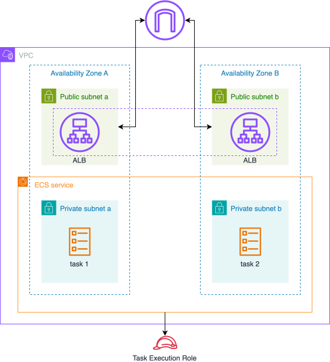

# Lab 2: Application Load Balancer Integration

## Overview

In this lab, you'll learn how to add an Application Load Balancer (ALB) to distribute traffic across your ECS tasks. We'll build upon the ECS infrastructure created in Lab 1.

## Key Concepts

### Application Load Balancer
- **Load Balancing**: Distributes incoming traffic across multiple targets
- **Target Groups**: Groups of resources that receive traffic from the load balancer
- **Health Checks**: Monitors the health of registered targets
- **Listeners**: Check for connection requests from clients
- **Rules**: Determine how traffic is routed to targets

## Architecture

We'll extend our Lab 1 architecture by adding:
1. Application Load Balancer in public subnets
2. Target Group for ECS tasks
3. Security groups for ALB
4. Updated ECS service with load balancer integration

