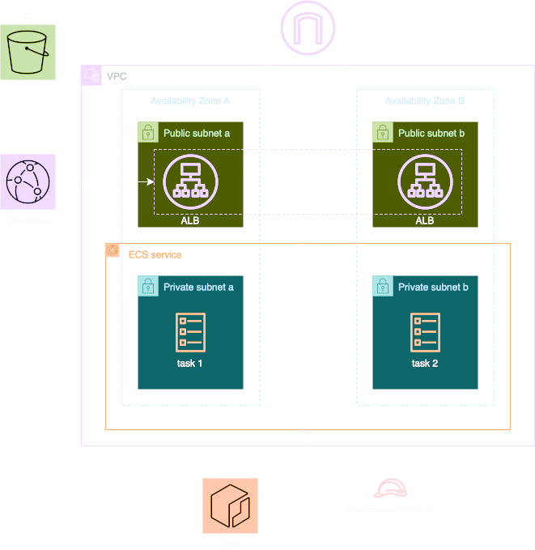

# Lab 4: Global Content Delivery with CloudFront

## Overview

In this lab, you'll learn how to:
1. Create a CloudFront distribution
2. Configure origin and behavior settings
3. Implement security headers
4. Set up custom error responses

## Key Concepts

### CloudFront
- Global content delivery network (CDN)
- Edge locations and regional caches
- Origin configurations
- Cache behaviors and TTLs
- Security features

## Architecture

We'll extend our application by adding:
1. CloudFront distribution
2. Origin access control
3. Security headers
4. Custom error pages

