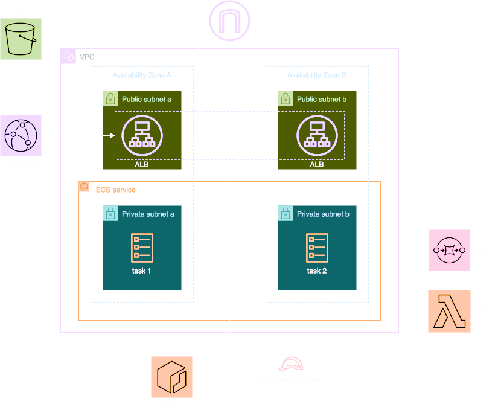

# Lab 5: Auto Scaling and Monitoring

## Overview

In this lab, you'll learn how to:
1. Set up ECS Auto Scaling
2. Configure CloudWatch alarms
3. Implement custom metrics
4. Create monitoring dashboards

## Key Concepts

### Auto Scaling
- Application scaling patterns
- Target tracking policies
- Step scaling policies
- Scheduled scaling

### Monitoring
- CloudWatch metrics
- Custom metrics
- Alarms and notifications
- Operational dashboards

## Architecture

We'll extend our application with:
1. ECS Service Auto Scaling
2. CloudWatch alarms
3. Custom metrics
4. SNS notifications

